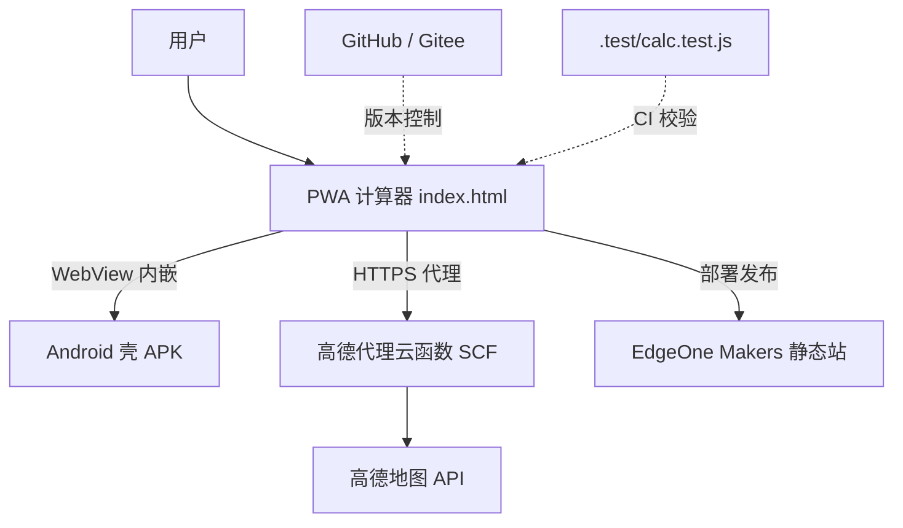

# 代驾距离收费计算 · 架构与全流程智能化说明

> 本文档记录项目结构、各模块职责，以及本轮引入的编辑器扩展能力（Skills / 专家 / 连接器 / 插件）如何贯穿「开发 → 构建 → 维护」全流程。

## 1. 系统架构

## 2. 模块职责

| 模块 | 路径 | 职责 |
|------|------|------|
| PWA 计算器 | 根目录 `index.html` / `manifest.json` / `sw.js` | 核心：滴滴 / E代驾 / 通用 三套费率，按时段 + 里程 + 等候计费，支持长途/商务/代泊车，含高德测距 |
| Android 壳 | `android/` | Kotlin + WebView，把 `assets/index.html` 离线打包成 APK（包名 `com.nbdaijia.calculator`） |
| 高德代理云函数 | `cloudfunctions/amap-proxy/` | 腾讯 SCF，转发高德方向/距离/地理编码请求，**隐藏 Key、白名单防滥用、内存缓存省配额** |
| 包名演示 | `android-package-demo/` | 与主线无关的「Android 包名获取」教学/参考项目 |

## 3. 扩展能力全景（本轮接入）

| 类别 | 名称 | 在本项目中的用途 |
|------|------|------------------|
| **Skill** | 前端设计（前端设计） | 重构 PWA：系统暗色模式 + 键盘无障碍焦点环，不改动计费逻辑 |
| **Skill** | EdgeOne Makers（edgeone-pages） | 构建/发布：将静态 PWA 部署为带 CDN/HTTPS 的线上地址 |
| **Skill** | recommend-connectors / recommend-experts | 盘点可用连接器与专家，筛选真正相关的能力 |
| **Connector（已连）** | EdgeOne Makers | 站点发布（部署优先级最高） |
| **Connector（已连）** | GitHub | 版本控制（本仓远端为 Gitee `mallwm_admin/didi-driving-fee-calculator`） |
| **Connector（已连）** | Agent Mail | 构建/发布结果可邮件通知 |
| **专家（建议启用）** | 像素匠 FrontendDeveloper | 持续的前端开发/维护伙伴 |
| **专家（建议启用）** | 掌中灵 MobileApplicationDeveloper | Android 壳原生迭代 |
| **连接器（建议接入）** | 腾讯文档 tencent-docs | 协作式维护文档/变更记录 |
| **连接器（建议接入）** | 腾讯云 CloudBase | 可选的统一后端（静态托管 + 云函数，替代 SCF 代理） |

## 4. 开发 → 构建 → 维护 工作流

- **开发（Dev）**：改 `index.html` 的 `PRESETS` 费率 → 跑 `node .test/calc.test.js`（25 例全过）→ `node sync-web.js` 同步到 `android/.../assets/`，杜绝两份网页分叉。
- **构建/发布（Build）**：通过 EdgeOne Makers 连接器 `edgeone makers deploy` 上线 PWA；Android 壳用 Gradle 打 APK。
- **维护（Maintain）**：GitHub/Gitee 版本控制；架构与扩展说明沉淀于本文件；发布/构建异常可经 Agent Mail 通知。

## 5. 验证结果

- 单测：`通过 25/25`（`node .test/calc.test.js`）
- 同步：根目录与 `android/app/src/main/assets/` 网页已一致（`node sync-web.js`）
- 云函数控制流：API 白名单拦截 400、缺 Key 500、OPTIONS 预检 204 已确认
- Android 壳：WebView 加载失败友好提示、viewport 优化、调试日志
- ⚠️ 远端 `git push` 需本机 Gitee SSH Key；当前环境无密钥，提交已在本地完成，待你本机 `git push origin main`。
- ✅ EdgeOne Makers 已上线：项目 `daijia-calc`（Production，全球加速）。访问地址见对话置顶（含 `?eo_token=` 鉴权参数，勿截断）。控制台：https://console.cloud.tencent.com/edgeone/pages/project/makers-fanpewlpbwjz/deployment/dpqxh172kxhe
